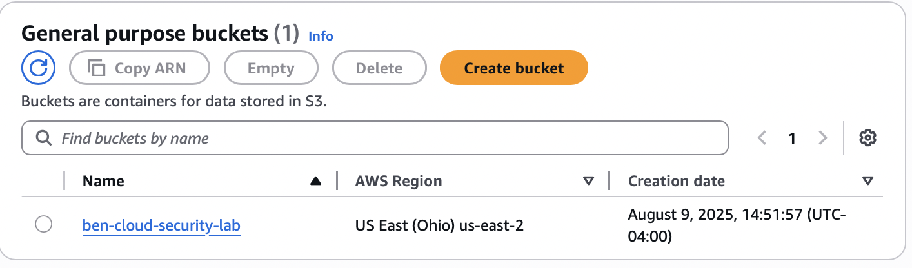
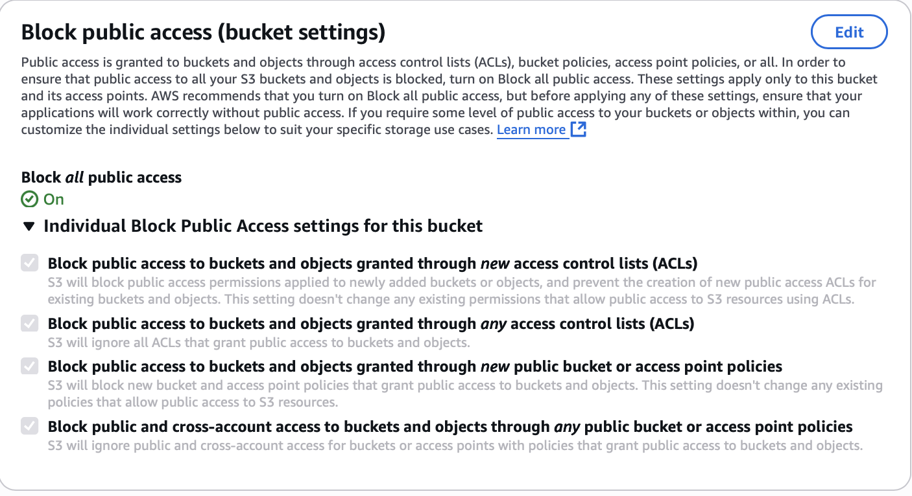
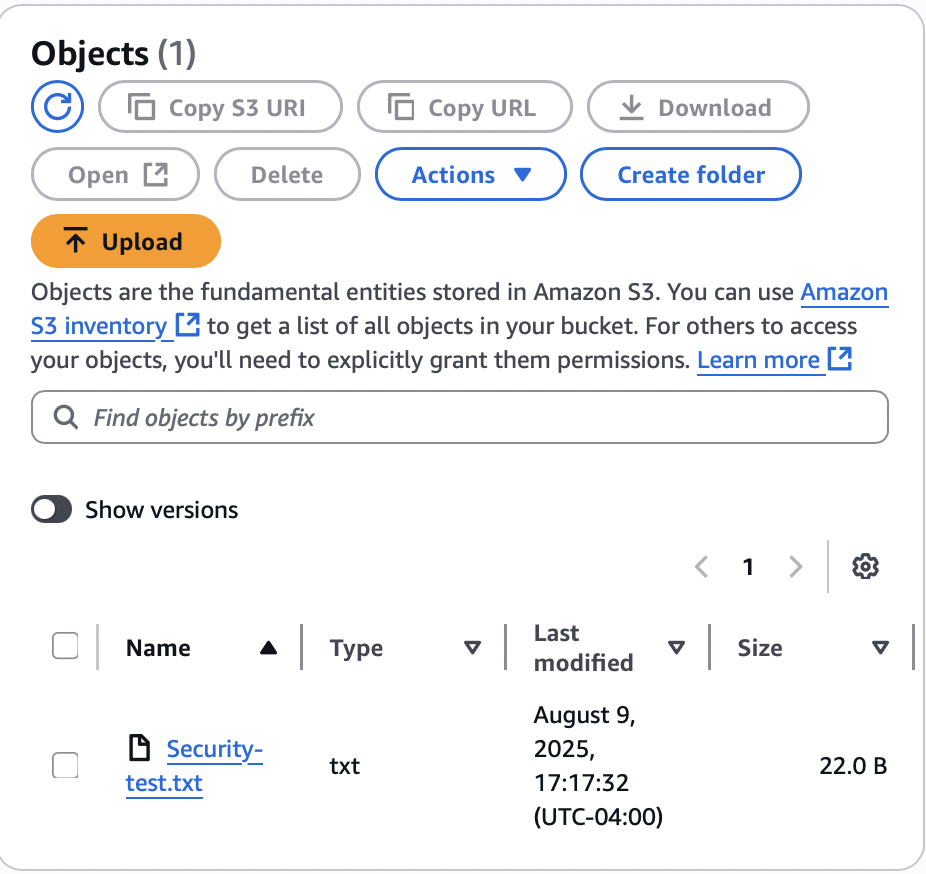
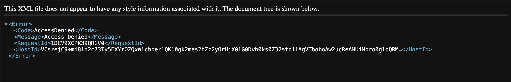

# AWS Cloud Security Lab

 

This short lab demonstrates how to set up and secure an Amazon S3 bucket to prevent unauthorized access, following cloud security best practices.

---

## Lab Overview
- **Service:** Amazon S3 (Simple Storage Service)  
- **Region used in demo:** US East (Ohio) — `us-east-2`  
- **Goal:** Create a secure bucket, configure access control, upload test objects, and verify that unauthorized access is denied.

---

## Visual Gallery
| S3 Overview | Bucket Permissions |
|---:|:---|
|  |  |

| Test File Uploaded | Access Denied (incognito) |
|---:|:---|
|  |  |

*Tip: click any image to view full size.*

---

## Step-by-step summary

1. **Create S3 bucket** `ben-cloud-security-lab`.  
2. **Uploaded** a small test file (`test.txt`).  
3. **Enabled Block Public Access** and verified the object is private by testing the object URL in an incognito window (showed **Access Denied**).  
4. **Documented** the steps and screenshots in this repo.

---

## How to reproduce (Console — easiest)
1. Sign in to the [AWS Console](https://console.aws.amazon.com/) and open **S3**.  
2. Click **Create bucket** → give a unique name (e.g., `ben-cloud-security-lab-<your-uid>`), choose region `us-east-2`.  
3. Under **Block Public Access settings**, keep **Block all public access** ON. Create bucket.  
4. Open the bucket → **Upload** → add a small `test.txt` file → Upload.  
5. Open the uploaded object → copy **Object URL** → paste into an Incognito window. You should see **Access Denied**.  
6. (Optional) From the bucket **Permissions** tab, confirm Block Public Access is ON.

---

## How to reproduce (AWS CLI — advanced)
> Make sure you have AWS CLI installed and `aws configure` set up with credentials.

```bash
# create a bucket (change name to something unique)
aws s3api create-bucket \
  --bucket ben-cloud-security-lab-unique123 \
  --region us-east-2 \
  --create-bucket-configuration LocationConstraint=us-east-2

# upload a test file
aws s3 cp test.txt s3://ben-cloud-security-lab-unique123/

# block all public access
aws s3api put-public-access-block \
  --bucket ben-cloud-security-lab-unique123 \
  --public-access-block-configuration BlockPublicAcls=true,IgnorePublicAcls=true,BlockPublicPolicy=true,RestrictPublicBuckets=true

# (optional) enable server-side encryption (SSE-S3)
aws s3api put-bucket-encryption \
  --bucket ben-cloud-security-lab-unique123 \
  --server-side-encryption-configuration '{"Rules":[{"ApplyServerSideEncryptionByDefault":{"SSEAlgorithm":"AES256"}}]}'

# (optional) create CloudTrail to log actions (requires a logs bucket)
aws s3 mb s3://ben-cloud-security-lab-logs-unique123 --region us-east-2
aws cloudtrail create-trail --name security-lab-trail --s3-bucket-name ben-cloud-security-lab-logs-unique123
aws cloudtrail start-logging --name security-lab-trail
